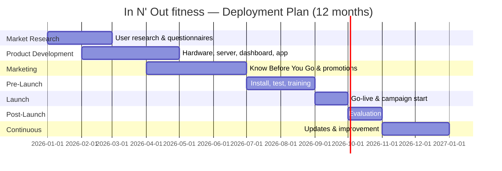

# Development & Business Operations
## Post-Prototype Business Operations Pitch — In N' Out fitness

**Document purpose:** Pitch what business operations will look like after the prototype phase, for investor and partner audiences. Covers 12‑month implementation, deployment plan, training, maintenance & support, revenue model, partners, and marketing.

---

## 1. Executive Summary

| Item | Description |
|------|-------------|
| **Product** | In N' Out fitness — Smart Sports Court Monitoring System |
| **Phase** | Transition from prototype to operational deployment |
| **Timeline** | 12‑month deployment plan (Jan–Dec); launch phase September; initial rollout at 1 site, then deploy per customer |
| **Ownership** | We retain ownership of the system; customers subscribe for access, maintenance, and features |
| **Revenue** | Subscription per court/site (website, modules, maintenance); optional paywall for extra features (e.g. analytics) |
| **Who pays** | Whoever engages us for the service (facility operator, town council, ActiveSG, gym, school, etc.) |
| **Support** | Facility staff use the system; end‑users (public) use the portal. We provide 24/7 maintenance capability (including night). Future status page. |
| **Partners** | ActiveSG, town councils, CCs, private companies/gyms, schools with public courts — both government and private. We assume partnerships are attainable; we do all installation and support in‑house. |
| **Audience** | Investor |

---

## 2. Implementation Plan — 12 Months (Overview)

The project deployment plan outlines the structured rollout of the In N' Out fitness system, aligned with the project timeline in the Gantt chart below. It covers all phases from market research and system development through deployment, maintenance, marketing, and continuous improvement — ensuring efficient use of resources, smooth implementation, and long-term sustainability. Deployed per customer: we set up for a facility or group; they pay subscription for website, extra features, and modules.

### 2.1 Timeline overview (aligned with Section 3)

| Phase | Duration | Key focus |
|-------|----------|-----------|
| **1. Market Research** | January – February | User needs, questionnaires, pain points, feature priorities |
| **2. Product Development** | February – April | Hardware, server, dashboard, mobile app, feedback interface, testing |
| **3. Marketing & Promotion** | April – June | “Know Before You Go” campaign, ActiveSG/collaborations, promotional materials |
| **4. Pre-Launch Preparation** | July – August | IoT installation, integration, testing, training, server/network checks |
| **5. Launch Phase** | September | System activation, public access, mobile app & feedback live, campaign launch |
| **6. Post-Launch Evaluation** | October | Uptime, sensor performance, user feedback, technical/usability issues |
| **7. Continuous Update & Improvement** | November – December and ongoing | Software updates, predictive maintenance, expansion, strategy refinement |

### 2.2 Figure: 12‑month deployment roadmap (Gantt)



*Launch phase: September.*

---

## 3. Project Deployment Plan (Detailed)

### Overview

The project deployment plan outlines the structured rollout of the In N' Out fitness system, aligned with the project timeline illustrated in the Gantt chart. The plan covers all phases from initial market research and system development to deployment, maintenance, marketing, and continuous improvement. This ensures efficient use of resources, smooth system implementation, and long-term sustainability.

---

### 1. Market Research (January – February)

This initial phase focuses on understanding user needs, usage behaviour, and challenges associated with public sports facilities.

**Key activities include:**

- Identifying the targeted user group
- Designing and distributing questionnaires
- Collecting feedback on court availability, crowding, and user expectations
- Analysing user pain points and desired features

The findings from this phase directly influence system requirements, feature selection, and overall system design.

---

### 2. Product Development (February – April)

During this phase, the core In N' Out fitness system is designed and developed based on insights obtained from market research.

**Key activities include:**

- Hardware development and sensor integration (crowd detection, environmental monitoring)
- Development of the server and live monitoring dashboard
- Mobile application and presence-activated feedback interface development
- System block diagram design and component allocation
- Initial system testing and debugging

This phase ensures the system meets functional, technical, and user requirements before deployment.

---

### 3. Marketing and Promotion Strategy (April – June)

Marketing preparation for In N' Out fitness begins before system launch to build awareness and encourage early adoption, in alignment with the Gantt chart’s Marketing and Promotion Strategy. Collaborations with ActiveSG and local sports clubs, along with promotional materials, are used to introduce key features such as real-time crowd monitoring, environmental tracking, and live feedback submission.

A core component of the marketing strategy is the **“Know Before You Go”** campaign. This is a straightforward awareness campaign (no gamification or rewards) focused on a single message: *check real-time crowd levels and environmental conditions before heading to the court — so you avoid wasted trips and play at the best times.*

**The “Know Before You Go” framework includes:**

- **Messaging:** Promote the value of real-time data — fewer wasted trips, better planning, safer play (heat/UV awareness).
- **Channels:** Promotional materials, social media, and partner touchpoints (ActiveSG, CCs, schools, gyms) directing users to the portal and on-site displays.
- **Content:** Short explainers, infographics, and FAQs on how to use the dashboard and feedback kiosk; testimonials or quotes from early pilot users where available.
- **Partnership visibility:** “Powered by In N' Out fitness” or similar at partner courts; co-branded materials with ActiveSG or facility operators.

Communication channels are prepared so users can easily find information about the system and how to access live data. Early marketing efforts ensure that users are informed and ready to use the system when it is officially launched.

This strategy increases user adoption and awareness of public sports facilities while driving traffic to the portal and feedback system, supporting system evaluation, maintenance planning, and continuous improvement.

---

### 4. Pre-Launch Preparation (July – August)

This phase focuses on final system readiness prior to public deployment.

**Key activities include:**

- Installation of IoT devices at selected public courts
- System integration and end-to-end testing
- Verification of data accuracy and system reliability
- Training of maintenance and support personnel
- Final checks on server stability and network connectivity

This phase minimises deployment risks and ensures operational readiness.

---

### 5. Launch Phase (September)

The official system launch takes place during this phase.

**Key milestones:**

- Activation of the In N' Out fitness system at pilot locations
- Public access to real-time crowd and environmental data
- Launch of the mobile application and feedback system
- Start of the “Know Before You Go” campaign in collaboration with ActiveSG

This marks the transition from development to real-world usage.

---

### 6. Post-Launch Evaluation (October)

Following deployment, system performance and user engagement are evaluated.

**Evaluation activities include:**

- Monitoring system uptime and sensor performance
- Analysing user feedback and participation rates
- Identifying technical or usability issues
- Assessing the effectiveness of marketing and engagement strategies

Results from this phase guide system refinement and future improvements.

---

### 7. Continuous Update and Improvement (November – December and Ongoing)

This phase ensures long-term system sustainability and scalability.

**Key activities include:**

- Software updates and performance optimisation
- Predictive maintenance using sensor and usage data
- Hardware replacement or upgrades when required
- Expansion to additional courts where feasible
- Continuous refinement of marketing and engagement strategies

---

## 4. Product Knowledge Training Plan

Training for facility staff and internal teams so they can operate and support In N' Out fitness.

### 4.1 Introduction to the product

- Explain purpose and target audience (facility operators, councils, gyms, schools; end-users viewing court status).
- Highlight how In N' Out fitness solves problems: real-time occupancy, crowd levels, environmental conditions, feedback, and display units — helping users find available playing time and better conditions.

### 4.2 Features & benefits

- Explain features and functionality: cloud server, Module 1 (Crowd), Module 2 (Environment), Module 3 (Feedback), Module 5 (Display), guest dashboard, personnel dashboard, portal.
- **Competitor comparison** — Key differences vs. manual signage or generic booking apps (real-time sensing, multi-module fusion, on-site display + web).

### 4.3 Customer care use cases

- Scenarios where In N' Out fitness solves problems: “Is the court full?”, “When is it less crowded?”, “Is it safe to play (heat/UV)?”, “Report maintenance issues.”
- Industry-specific applications: public courts, schools, CCs, private gyms.

### 4.4 Practical demonstrations

- **Product walkthrough** — Video-based demo of dashboards, modules, and portal in action.
- **Hands-on practice** — Trainees use personnel dashboard, simulate incidents, and practise escalation.

### 4.5 Troubleshooting

- Train staff on typical technical and user issues (module offline, wrong count, display not updating, portal access).
- Step-by-step support resources and links to knowledge base (and future status page).

### 4.6 Training tools & resources

- Materials: slides, videos, instruction manuals.
- Knowledge base: FAQs, troubleshooting guides, updates.

### 4.7 Assessment & certification

- Mock client interactions to assess practical application.
- Certification upon completion for facility Registered Support Contacts (see Section 5).

---

## 5. Product Maintenance & Support Plan

We own the system; customers subscribe for maintenance, website, and modules. Support is provided to facility staff (who operate the system); end-users use the portal. 24/7 maintenance capability for network/server issues; future status page and support portal planned.

### 5.1 Warranty coverage and support procedures

**Warranty coverage for IoT devices: 5 years.**

| Issue type | Procedure |
|------------|-----------|
| **System-related issues** | Dispatch an Engineer to perform an on-site evaluation and attempt resolution. If the issue cannot be resolved immediately: remove the affected device for further evaluation at the office. If the device is found to be faulty due to wear and tear: provide a 1-to-1 replacement. |
| **Network-related issues** | If the live monitoring dashboard or server system is down, our Network Engineer will attempt to resolve the issue remotely (**available 24/7**). If the issue is found to be due to hardware malfunction, follow the procedure outlined in the System-related issues section. |
| **User interface issues** | If the presence-activated feedback system or mobile app is unresponsive, the Support Team will troubleshoot remotely first. If the problem persists, the system will be checked on-site, and faulty components will be repaired or replaced as needed. |

**Proactive monitoring:**

- Engineers monitor the server data for patterns, including sensor readings, usage levels, and user feedback, to detect early signs of potential issues.
- Predictive analysis allows maintenance or replacement of devices to be carried out only when necessary, reducing downtime and improving efficiency.

---

### 5.2 Additional support terms (SLAs and tiers)

After the default 5-year warranty, clients may purchase a **Maintenance Plan** (Silver, Gold, Platinum) with differentiated response times and support capacity.

| Element | Description |
|--------|-------------|
| **Registered Support Contact (RSC)** | Support is provided to the client’s designated staff (e.g. limited to a set number of individuals per tier). RSC can be changed; additional contacts may require approval. |
| **Response time** | As per In N' Out fitness Response Time Chart (Section 5.4). |
| **Web-based support** | 24/7 access for RSC to log and track incidents, use knowledge base, and submit support requests. *Subject to planned maintenance and reasonable downtime.* |
| **Product updates** | Maintenance releases, minor additions, and new software versions during the term. Major versions or optional modules (e.g. analytics) may be separate or paywalled. |
| **Health checks** | Annual health check (installation analysis, report, recommendations, preventative maintenance). Remote and on-site; scope and duration as per contract. Additional work at agreed rates. |

### 5.3 Client obligations

- Clients provide sufficient information and access (e.g. remote session or virtual image) so that technical personnel can reproduce and resolve issues. Failure to do so may result in longer resolution times.

### 5.4 In N' Out fitness response time chart

| Severity | Initial response — Silver | Initial response — Gold | Initial response — Platinum |
|----------|---------------------------|-------------------------|-----------------------------|
| **Severity 1 (Urgent)** | 14 business hours | 4 business hours | 4 business hours |
| **Severity 2 (High)** | 14 business hours | 7 business hours | 4 business hours |
| **Severity 3 (Normal)** | 14 business hours | 14 business hours | 7 business hours |
| **Severity 4 (Low)** | 14 business hours | 14 business hours | 14 business hours |

| Tier | Max RSC | On-site technicians (max) |
|------|---------|----------------------------|
| Silver | 3 | 3 |
| Gold | 4 | 3 |
| Platinum | 4 | 5 |

**Severity definitions:**

| Level | Definition |
|-------|------------|
| **Severity 1 (Urgent)** | System down, security issue, or major business impact (e.g. all courts at site offline). |
| **Severity 2 (High)** | Key modules failed or significant impact (e.g. crowd or display module down). |
| **Severity 3 (Normal)** | Issues that do not fall under Severity 1 or 2. |
| **Severity 4 (Low)** | Minimal impact, low priority. |

*In N' Out fitness will not be liable for loss of transaction or business/operations impediments beyond what is agreed in contract.*

### 5.5 Support and status page links (future)

- **Status page:** *e.g. status.innoutfitness.sg* (planned).
- **Support portal / ticketing:** *e.g. support.innoutfitness.sg*
- **FAQ / knowledge base:** *e.g. help.innoutfitness.sg*

---

## 6. Revenue Model — Where Money Comes From

**Model:** We set up In N' Out fitness for a facility or group; they pay a **subscription** to maintain the website, extra features, and the modules. **Whoever asks us for the service pays** (facility, town council, ActiveSG, gym, school, etc.). Customers can optionally **paywall additional features** (e.g. analytics).

### 6.1 Revenue streams

| Stream | Description |
|--------|-------------|
| **Subscription (per court/site)** | Recurring fee for cloud dashboard, portal, modules, maintenance, and support. Primary revenue. |
| **Optional paywall features** | Customers choose to pay for add-ons (e.g. analytics, advanced reporting, extra integrations). |
| **One-off or financed setup** | If applicable: initial installation or hardware financed into subscription. |

### 6.2 Fee suggestion (cost-based)

Fees are suggested based on **estimated production and maintenance costs** on our side. Below are placeholder ranges; replace with your actual cost estimates and target margin.

| Item | Suggested basis | Placeholder range (replace with real numbers) |
|------|------------------|-----------------------------------------------|
| **Subscription per court (monthly)** | Cost to run server, support, and maintenance per court | $X–$Y per court/month |
| **Subscription per site (monthly)** | Bundle for multi-court venues | $A–$B per site/month |
| **Analytics / paywall add-on** | Extra development and support for analytics | $Z per site/month or % of base |
| **Setup / installation** | Labour, travel, hardware margin (if not included in subscription) | One-off $W or folded into first year |

**Note:** Calibrate X, Y, A, B, Z, W from: (1) server and cloud costs, (2) support and maintenance labour, (3) hardware and replacement reserve, (4) target margin. Update this table when figures are finalised.

### 6.3 Revenue mix (conceptual)

```
┌─────────────────────────────────────────────────────────────┐
│  Post-Prototype Revenue Mix (In N' Out fitness)                     │
├─────────────────────────────────────────────────────────────┤
│  ████████████████████████████████  Subscription      ~80%   │
│  ████████                          Paywall (analytics) ~15% │
│  ██                                Setup / other        ~5%  │
└─────────────────────────────────────────────────────────────┘
```

---

## 7. Partners

We partner with **ActiveSG, town councils, CCs, private companies/gyms, and schools with public courts** — both government and private. We assume partnerships are attainable; **we do all installation and support** (no external implementer).

### 7.1 Partner categories

| Category | Role | Examples |
|----------|------|----------|
| **Government / public** | Pilots, procurement, public courts | ActiveSG, town councils, CCs, schools with public courts |
| **Private** | Gyms, private sports facilities, campuses | Gyms, private operators |
| **Technology** | Hardware, cloud (if needed) | BeagleBone / TI; cloud provider; AI/vision (as needed) |

### 7.2 Who pays

- **Whoever engages us for the service** — facility operator, town council, ActiveSG, gym, school, etc. — pays the subscription (and optional paywall features they choose).

### 7.3 Partner and customer flow

```
┌─────────────────────────────────────────────────────────────────┐
│  In N' Out fitness                                                      │
│  (We own system; we do install + support)                        │
└─────────────────────────────────────────────────────────────────┘
         │
         │ Subscription + optional paywall
         ▼
┌──────────────────┬──────────────────┬──────────────────┐
│  Government /     │  Private         │  Schools /        │
│  public           │  (gyms, etc.)    │  campuses        │
│  ActiveSG,        │                  │  (public courts) │
│  town councils,   │                  │                  │
│  CCs              │                  │                  │
└──────────────────┴──────────────────┴──────────────────┘
```

---

## 8. Marketing Plan (Summary)

To advance and publicise In N' Out fitness, we use a multi-pronged approach. The core campaign is **“Know Before You Go”** (detailed in Section 3, phase 3): a straightforward awareness campaign — check real-time crowd and conditions before you go; no gamification or rewards.

### 8.1 Target audience

- **Primary:** Facility operators, town councils, ActiveSG, CCs, schools, gyms (who pay for the service).
- **Secondary:** End-users (players, families) who benefit from the portal and on-site displays; investors and media.

### 8.2 Approaches

| Approach | Actions |
|----------|--------|
| **Know Before You Go** | Awareness campaign: check real-time crowd and conditions before heading to the court; promotional materials and partner channels (Section 3). |
| **Partnerships** | Collaborate with ActiveSG, CCs, schools, and private gyms for pilots and case studies. |
| **Content & channels** | Promotional materials, participation guidelines, rewards info; social media and PR. |
| **Early adopters** | Promotional pricing or incentives for first facilities to adopt. |

### 8.3 Differentiation

- Real-time sensing and multi-module fusion (crowd, environment, feedback, display).
- Subscription model with optional analytics paywall.
- We own the system and provide full install and support (24/7 maintenance capability).

---

## 9. Document control and next steps

| # | Item |
|---|------|
| 1 | Replace placeholder fee ranges (Section 6.2) with cost-based estimates and target margin. |
| 2 | Gantt aligned to Jan–Dec deployment plan; launch phase September. |
| 3 | Add real URLs when status page and support portal go live. |
| 4 | Finalise warranty term and maintenance tier names (Silver/Gold/Platinum) and pricing. |
| 5 | Copy into Word and add any infographics (e.g. roadmap, revenue mix, partner flow) as figures. |

---

*Document version: 0.4 — Court Challenge removed; replaced with “Know Before You Go” awareness campaign (no gamification).*  
*Product: In N' Out fitness — Smart Sports Court Monitoring System.*
