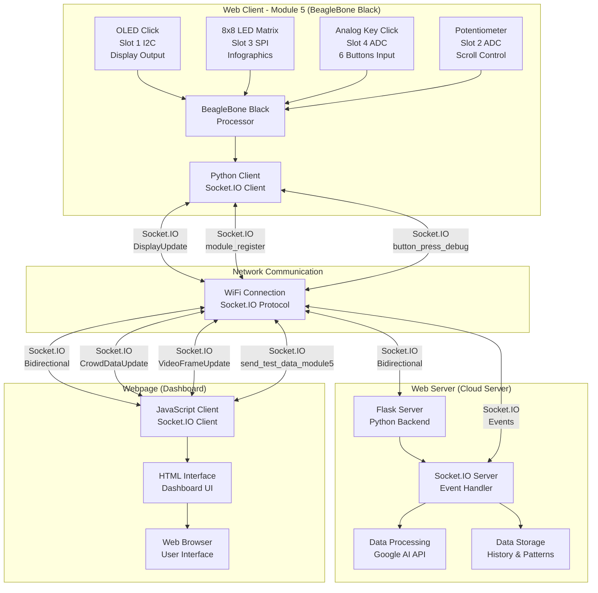
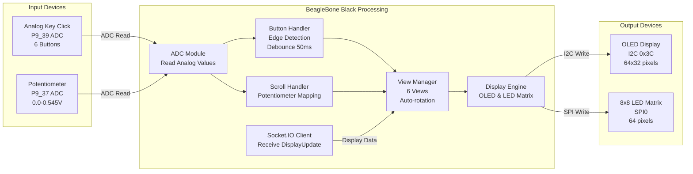
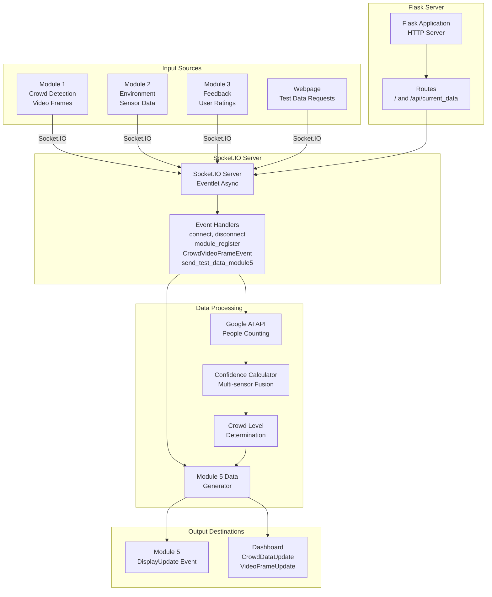
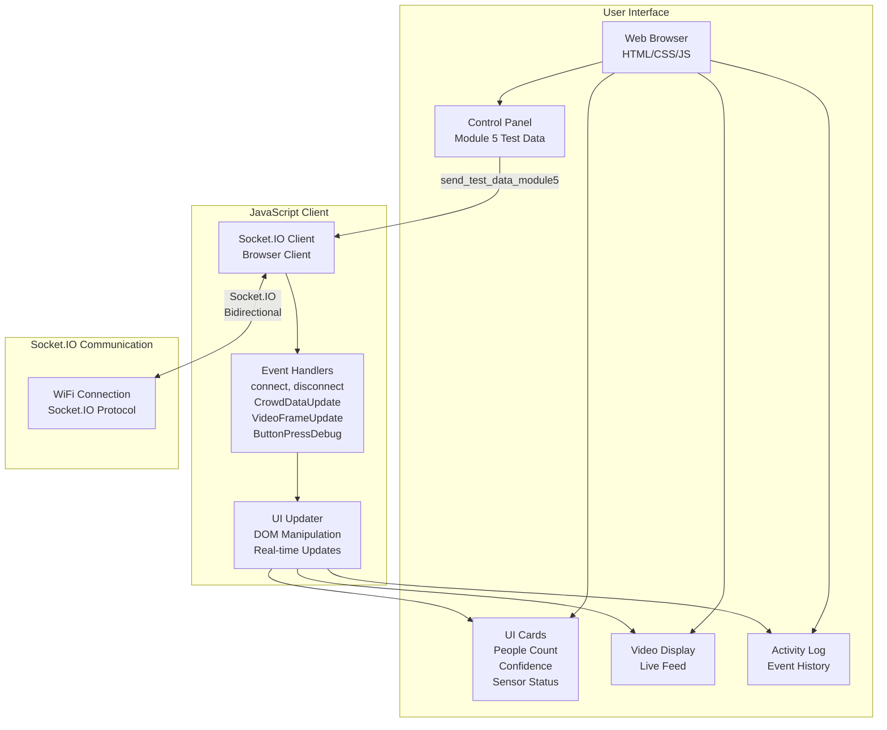
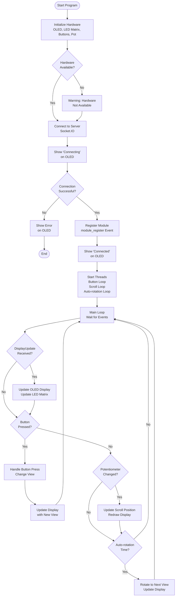
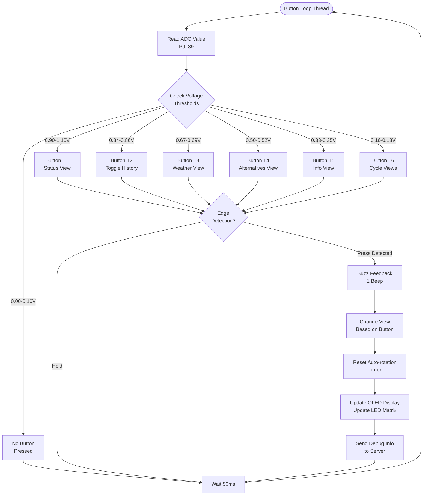
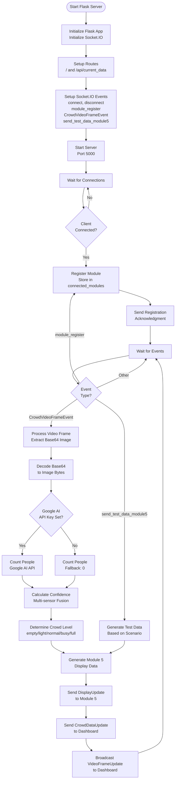
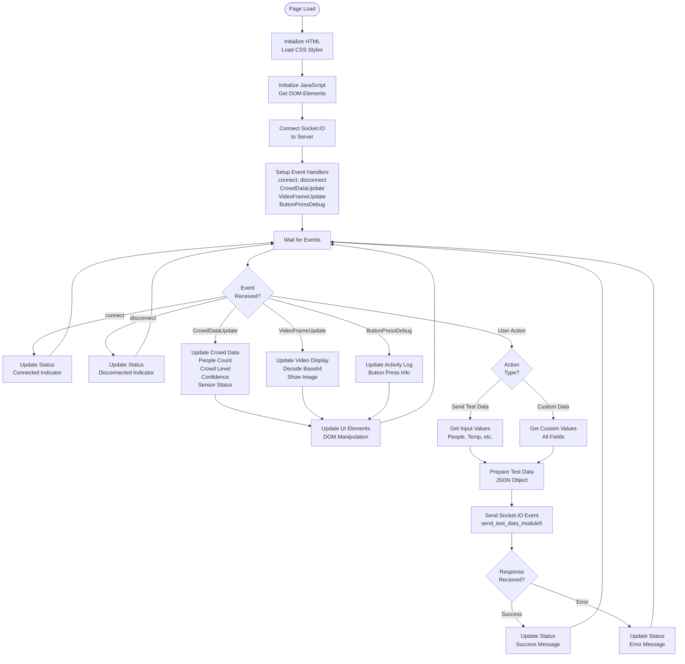
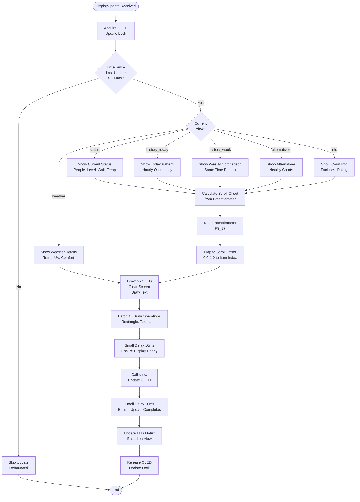

# EGE205 Connect System Design Project
## Assignment Documentation

**Student's Name:** [Your Name]  
**Student's Admin Number:** [Your Admin Number]  
**Date:** [Date]

---

# Part 1: Assignment Criteria and Constraints

## 1.1 Assignment Criteria

Based on the system design and implementation, the following criteria were established:

### Hardware Requirements
1. **Minimum Click Board Requirement:** At least 2 click boards (1 input + 1 output minimum)
   - **Actual Implementation:** 4 click boards used
     - **Input Clicks (2):** Analogue Key Click (6-button keypad), Potentiometer
     - **Output Clicks (2):** OLED Click (display), 8x8 LED Matrix Click (infographics)

2. **BeagleBone Black Wireless Platform:** Required for hardware interface and processing

3. **Communication Protocol:** Socket.IO (WebSocket) over HTTP for real-time bidirectional communication

### Software Requirements
1. **Three-Part System Architecture:**
   - **Web Client (Module 5):** Python client running on BeagleBone Black
   - **Web Server:** Flask server with Socket.IO for data processing and distribution
   - **Webpage:** HTML/JavaScript dashboard for monitoring and control

2. **Real-time Data Updates:** System must update displays within 30 seconds of sensor data changes

3. **User Interface:** Multiple views accessible via button navigation with auto-rotation feature

### Functional Requirements
1. **Display Capabilities:**
   - Current court status (people count, crowd level, wait time)
   - Historical patterns (hourly and weekly)
   - Weather information
   - Alternative court recommendations
   - Court facility information

2. **User Interaction:**
   - 6-button navigation (T1-T6) for view selection
   - Potentiometer for scrolling through scrollable views
   - Auto-rotation after 60 seconds of inactivity

3. **Data Visualization:**
   - OLED display (64x32) for text and status information
   - 8x8 LED Matrix for graphical infographics

## 1.2 Constraints

### Hardware Constraints
1. **BeagleBone Black Pin Limitations:**
   - Limited I2C buses (used for OLED)
   - Limited SPI buses (used for LED Matrix)
   - Limited ADC channels (used for buttons and potentiometer)
   - Pin conflicts must be avoided

2. **Click Board Slot Assignments:**
   - **Slot 1 (I2C):** OLED Click - I2C address 0x3C
   - **Slot 2 (ADC):** Potentiometer - P9_37
   - **Slot 3 (SPI):** 8x8 LED Matrix - SPI0 (CS=P9_17, SCK=P9_22, MISO=P9_29, MOSI=P9_18)
   - **Slot 4 (ADC):** Analog Key Click - P9_39

3. **Power Requirements:**
   - All click boards powered via BeagleBone Black headers
   - Must ensure adequate power supply for all components

4. **Physical Constraints:**
   - OLED display size: 64x32 pixels (limited text display area)
   - 8x8 LED Matrix: 64 pixels total (limited graphical detail)

### Software Constraints
1. **Network Dependency:**
   - Requires stable WiFi connection for Socket.IO communication
   - Server must be accessible at configured IP address
   - No offline functionality

2. **Processing Limitations:**
   - BeagleBone Black processing power limits complex computations
   - Display updates debounced to 100ms minimum to prevent corruption

3. **Library Dependencies:**
   - Requires specific hardware libraries (Adafruit CircuitPython, custom libraries)
   - Library availability affects hardware functionality

### Design Constraints
1. **Display Update Rate:**
   - Minimum 100ms debounce between OLED updates
   - Thread-safe updates required to prevent display corruption

2. **Button Debouncing:**
   - 50ms debounce for analogue keypad
   - Edge detection required to prevent multiple triggers

3. **Data Format:**
   - JSON format for all Socket.IO messages
   - Specific data structure required for display updates

### Performance Constraints
1. **Response Time:**
   - Button press to display update: < 200ms
   - Server data processing: < 2 seconds
   - Display refresh: 30-second intervals

2. **Memory Constraints:**
   - Limited RAM on BeagleBone Black
   - Data history limited to last 100 entries

---

# Part 2: Block Diagram

## 2.1 System Overview Block Diagram



## 2.2 Web Client (Module 5) Block Diagram



## 2.3 Web Server Block Diagram



## 2.4 Webpage (Dashboard) Block Diagram



---

# Part 3: Schematic / Circuit Diagram

## 3.1 BeagleBone Black Pin Connections

### I2C Bus (Slot 1 - OLED Click)
```
BeagleBone Black          OLED Click
─────────────────         ───────────
P9_19 (I2C2_SCL)  ───────> SCL
P9_20 (I2C2_SDA)  ───────> SDA
P9_03 (3.3V)      ───────> VCC
P9_01 (GND)       ───────> GND
                          I2C Address: 0x3C
```

### ADC Channel (Slot 2 - Potentiometer)
```
BeagleBone Black          Potentiometer
─────────────────         ─────────────
P9_37 (AIN2)      ───────> Wiper (Variable Output)
P9_03 (3.3V)     ───────> VCC (High End)
P9_01 (GND)      ───────> GND (Low End)
                          Voltage Range: 0.0V - 0.545V
                          (Mapped to 0.0-1.0 in software)
```

### SPI Bus (Slot 3 - 8x8 LED Matrix Click)
```
BeagleBone Black          8x8 LED Matrix Click
─────────────────        ────────────────────
P9_17 (SPI0_CS0)  ───────> CS (Chip Select)
P9_22 (SPI0_SCLK) ───────> SCK (Clock)
P9_29 (SPI0_MISO) ───────> MISO (Master In)
P9_18 (SPI0_MOSI) ───────> MOSI (Master Out)
P9_03 (3.3V)      ───────> VCC
P9_01 (GND)       ───────> GND
                          SPI Bus: 0, Device: 0
```

### ADC Channel (Slot 4 - Analog Key Click)
```
BeagleBone Black          Analog Key Click
─────────────────         ────────────────
P9_39 (AIN0)      ───────> Analog Output
P9_03 (3.3V)     ───────> VCC
P9_01 (GND)      ───────> GND
                          Button Thresholds:
                          T1: 0.90-1.10V
                          T2: 0.84-0.86V
                          T3: 0.67-0.69V
                          T4: 0.50-0.52V
                          T5: 0.33-0.35V
                          T6: 0.16-0.18V
                          NONE: 0.00-0.10V
```

## 3.2 Complete System Schematic

```
┌─────────────────────────────────────────────────────────────┐
│                    BeagleBone Black Wireless                │
│                                                              │
│  ┌──────────────┐  ┌──────────────┐  ┌──────────────┐    │
│  │   Slot 1     │  │   Slot 2     │  │   Slot 3     │    │
│  │  OLED Click  │  │ Potentiometer│  │ 8x8 LED Matrix│    │
│  │   (I2C)      │  │    (ADC)     │  │    (SPI)      │    │
│  │              │  │              │  │              │    │
│  │ SCL ← P9_19  │  │ AIN2 ← P9_37 │  │ CS  ← P9_17  │    │
│  │ SDA ← P9_20  │  │              │  │ SCK ← P9_22  │    │
│  │ VCC ← P9_03  │  │ VCC ← P9_03  │  │ MISO← P9_29  │    │
│  │ GND ← P9_01  │  │ GND ← P9_01  │  │ MOSI← P9_18  │    │
│  │              │  │              │  │ VCC ← P9_03  │    │
│  │ Addr: 0x3C   │  │ Range: 0-0.545│  │ GND ← P9_01  │    │
│  └──────────────┘  └──────────────┘  └──────────────┘    │
│                                                              │
│  ┌──────────────┐                                           │
│  │   Slot 4     │                                           │
│  │ Analog Key   │                                           │
│  │   Click      │                                           │
│  │    (ADC)     │                                           │
│  │              │                                           │
│  │ AIN0 ← P9_39 │                                           │
│  │ VCC ← P9_03  │                                           │
│  │ GND ← P9_01  │                                           │
│  │              │                                           │
│  │ 6 Buttons    │                                           │
│  └──────────────┘                                           │
│                                                              │
│  ┌──────────────────────────────────────────────────────┐  │
│  │              WiFi Module (Built-in)                   │  │
│  │  ┌────────────────────────────────────────────────┐  │  │
│  │  │  Socket.IO Client Connection                    │  │  │
│  │  │  Server: http://192.168.18.89:5000            │  │  │
│  │  └────────────────────────────────────────────────┘  │  │
│  └──────────────────────────────────────────────────────┘  │
└─────────────────────────────────────────────────────────────┘
                              │
                              │ WiFi Network
                              │ Socket.IO Protocol
                              │
                              ▼
┌─────────────────────────────────────────────────────────────┐
│                    Cloud Server (PC/Laptop)                  │
│                                                              │
│  ┌──────────────────────────────────────────────────────┐  │
│  │              Flask + Socket.IO Server                 │  │
│  │  - Receives data from Module 1, 2, 3                 │  │
│  │  - Processes with Google AI API                      │  │
│  │  - Generates Module 5 display data                   │  │
│  │  - Sends DisplayUpdate to Module 5                   │  │
│  │  - Broadcasts to Dashboard                           │  │
│  └──────────────────────────────────────────────────────┘  │
└─────────────────────────────────────────────────────────────┘
                              │
                              │ HTTP/WebSocket
                              │
                              ▼
┌─────────────────────────────────────────────────────────────┐
│                    Web Browser (Dashboard)                   │
│                                                              │
│  ┌──────────────────────────────────────────────────────┐  │
│  │              HTML/JavaScript Client                  │  │
│  │  - Displays real-time data                           │  │
│  │  - Shows video feed                                  │  │
│  │  - Sends test data to Module 5                       │  │
│  │  - Activity log                                      │  │
│  └──────────────────────────────────────────────────────┘  │
└─────────────────────────────────────────────────────────────┘
```

## 3.3 Click Board Pin Mapping Table

| Click Board | Slot | Interface | BeagleBone Pin | Function | Voltage/Protocol |
|-------------|------|-----------|----------------|----------|------------------|
| OLED Click | 1 | I2C | P9_19 (SCL)<br/>P9_20 (SDA) | Clock<br/>Data | 3.3V I2C<br/>Address: 0x3C |
| Potentiometer | 2 | ADC | P9_37 (AIN2) | Analog Input | 0.0-0.545V |
| 8x8 LED Matrix | 3 | SPI | P9_17 (CS)<br/>P9_22 (SCK)<br/>P9_29 (MISO)<br/>P9_18 (MOSI) | Chip Select<br/>Clock<br/>Master In<br/>Master Out | 3.3V SPI<br/>Bus 0, Device 0 |
| Analog Key Click | 4 | ADC | P9_39 (AIN0) | Analog Input | 0.0-1.1V<br/>6 Buttons |

## 3.4 Power Distribution

```
Power Source: BeagleBone Black 5V DC Input
                    │
                    ├──> 3.3V Regulator (P9_03)
                    │    ├──> OLED Click VCC
                    │    ├──> Potentiometer VCC
                    │    ├──> 8x8 LED Matrix VCC
                    │    └──> Analog Key Click VCC
                    │
                    └──> GND (P9_01, P9_02)
                         ├──> OLED Click GND
                         ├──> Potentiometer GND
                         ├──> 8x8 LED Matrix GND
                         └──> Analog Key Click GND
```

---

# Part 4: Flow Chart

## 4.1 Web Client (Module 5) Main Flow Chart



## 4.2 Web Client Button Handling Flow Chart



## 4.3 Web Server Main Flow Chart



## 4.4 Webpage (Dashboard) Flow Chart



## 4.5 Display Update Flow Chart (Module 5)



---

# Part 5: Program Code

## 5.1 Web Client Code (Module 5)

### Main Program Structure

The web client code is organized into the following sections:

1. **Configuration and Imports**
2. **Hardware Initialization**
3. **Display Functions**
4. **Button and Input Handling**
5. **Socket.IO Event Handlers**
6. **Main Loop and Threads**

### Key Code Sections

#### 5.1.1 Configuration Section

```python
# ========== CONFIGURATION ==========
SERVER_URL = 'http://192.168.18.89:5000'  # Cloud server IP
COURT_ID = 'basketball_a'
MODULE_ID = 'court_display_5_a'
OLED_WIDTH = 64  # OLED display dimensions
OLED_HEIGHT = 32
AUTO_ROTATION_IDLE_SECONDS = 60  # Auto-rotate after 60 seconds
```

#### 5.1.2 Hardware Initialization

```python
def init_oled():
    """Initialize OLED display - Slot 1 (I2C)"""
    global oled_display
    if not OLED_AVAILABLE:
        return
    try:
        oled_display = OledDisplay(lazy_hw=True)
        oled_display.open()
        oled_display.clear()
        oled_display.draw_text("Module 5", 0, 0)
        oled_display.draw_text("Ready...", 0, 10)
    except Exception as e:
        print(f"[OLED] Error: {e}")
        oled_display = None

def init_bar_graph():
    """Initialize 8x8 LED Matrix - Slot 3 (SPI)"""
    global led_matrix
    if not LEDMATRIX_AVAILABLE:
        return
    try:
        led_matrix = LedMatrix8x8(bus=0, device=0, lazy_hw=True)
        led_matrix.open()
        led_matrix.set_preset("smiley")
        time.sleep(0.5)
        led_matrix.clear()
    except Exception as e:
        print(f"[LEDMATRIX] Error: {e}")
        led_matrix = None

def init_buttons():
    """Initialize Analog Key Click - Slot 4 (ADC)"""
    global analogue_keypad
    if not KEYPAD_AVAILABLE:
        return
    try:
        thresholds = {
            "T1": (0.90, 1.10),
            "T2": (0.84, 0.86),
            "T3": (0.67, 0.69),
            "T4": (0.50, 0.52),
            "T5": (0.33, 0.35),
            "T6": (0.16, 0.18),
            "NONE": (0.00, 0.10)
        }
        analogue_keypad = AnalogueKeypad(
            pin="P9_39", 
            lazy_hw=True, 
            thresholds=thresholds, 
            debounce_ms=50
        )
        analogue_keypad.open()
    except Exception as e:
        print(f"[BUTTONS] Error: {e}")
        analogue_keypad = None

def init_potentiometer():
    """Initialize potentiometer - Slot 2 (ADC)"""
    global pot_adc, POT_AVAILABLE
    try:
        import Adafruit_BBIO.ADC as ADC
        pot_adc = ADC
        ADC.setup()
        POT_AVAILABLE = True
    except ImportError:
        POT_AVAILABLE = False
        pot_adc = None
```

#### 5.1.3 Socket.IO Event Handlers

```python
@sio.event
def connect():
    """Called when connected to server"""
    print(f'[{datetime.now().strftime("%H:%M:%S")}] Module 5 connected')
    sio.emit('module_register', {
        'module_id': MODULE_ID,
        'module_type': 'display',
        'court_id': COURT_ID,
        'timestamp': datetime.now().isoformat()
    })

@sio.event
def DisplayUpdate(data):
    """Receive display update from server"""
    global current_data
    current_data = data
    update_oled_display(current_view, data)
```

#### 5.1.4 Button Handling

```python
def handle_button_press(button_id):
    """Handle button press - switch views"""
    global current_view, last_interaction_time
    if button_id == 0:
        return
    
    buzz_beep(1)  # Audio feedback
    
    if button_id == 1:
        current_view = 'status'
    elif button_id == 2:
        if current_view == 'history_today':
            current_view = 'history_week'
        else:
            current_view = 'history_today'
    elif button_id == 3:
        current_view = 'weather'
    elif button_id == 4:
        current_view = 'alternatives'
    elif button_id == 5:
        current_view = 'info'
    elif button_id == 6:
        view_order = ['status', 'history_today', 'history_week', 
                     'weather', 'alternatives', 'info']
        try:
            current_index = view_order.index(current_view)
            current_view = view_order[(current_index + 1) % len(view_order)]
        except ValueError:
            current_view = 'status'
    
    last_interaction_time = time.time()
    if current_data:
        update_oled_display(current_view, current_data)
```

#### 5.1.5 Main Function

```python
def main():
    """Main function"""
    print("=" * 60)
    print("Module 5: Smart Court Information Display")
    print("=" * 60)
    
    # Initialize hardware
    init_oled()
    init_buttons()
    init_potentiometer()
    init_bar_graph()
    
    # Connect to server
    try:
        show_connecting()
        sio.connect(SERVER_URL)
        time.sleep(1)
        
        if sio.connected:
            show_connected()
            time.sleep(1)
            
            # Start threads
            if analogue_keypad:
                button_thread = threading.Thread(target=button_loop, daemon=True)
                button_thread.start()
            
            if POT_AVAILABLE:
                scroll_thread = threading.Thread(target=scroll_update_loop, daemon=True)
                scroll_thread.start()
            
            if auto_rotation_enabled:
                rotation_thread = threading.Thread(target=auto_rotation_loop, daemon=True)
                rotation_thread.start()
            
            # Keep main thread alive
            while True:
                time.sleep(1)
    except KeyboardInterrupt:
        print("\nStopping...")
    finally:
        if sio.connected:
            sio.disconnect()
        # Cleanup hardware
        print("Client disconnected. Goodbye!")

if __name__ == '__main__':
    main()
```

**Full code file:** `Assignment/module5/Module5_Display_Client.py` (1890 lines)

**GitHub Link:**
- **View File:** https://github.com/YOUR_USERNAME/YOUR_REPO/blob/main/Assignment/module5/Module5_Display_Client.py
- **Raw File:** https://github.com/YOUR_USERNAME/YOUR_REPO/raw/main/Assignment/module5/Module5_Display_Client.py

---

## 5.2 Web Server Code

### Main Program Structure

The web server code is organized into:

1. **Configuration and Setup**
2. **Data Processing Functions**
3. **Flask Routes**
4. **Socket.IO Event Handlers**
5. **Server Startup**

### Key Code Sections

#### 5.2.1 Server Configuration

```python
# ========== CONFIGURATION ==========
SERVER_IP = '192.168.18.89'
SERVER_PORT = 5000
GOOGLE_AI_API_KEY = os.getenv('GOOGLE_AI_API_KEY', '')

# ========== FLASK APP SETUP ==========
app = Flask(__name__)
socketio = SocketIO(app, async_mode='eventlet', cors_allowed_origins="*")
```

#### 5.2.2 Data Processing Functions

```python
def process_image_with_google_ai(image_bytes):
    """Process image with Google AI API to count people"""
    try:
        if not GOOGLE_AI_API_KEY:
            return 0
        
        import google.generativeai as genai
        genai.configure(api_key=GOOGLE_AI_API_KEY)
        model = genai.GenerativeModel('gemini-pro-vision')
        
        prompt = """Count the number of people visible in this image. 
        Look for human figures, faces, or people playing sports.
        Return ONLY a number, nothing else."""
        
        response = model.generate_content([prompt, {
            'mime_type': 'image/jpeg',
            'data': image_bytes
        }])
        
        response_text = response.text.strip()
        import re
        numbers = re.findall(r'\d+', response_text)
        if numbers:
            return max(0, int(numbers[0]))
        return 0
    except Exception as e:
        print(f'[ERROR] Google AI API error: {e}')
        return 0

def calculate_confidence(people_count, noise_db, motion_detected, proximity_triggered):
    """Calculate confidence score based on multiple sensors"""
    confidence = 0.5  # Base confidence
    
    if people_count > 0:
        confidence += 0.3
    if noise_db > 60:
        confidence += 0.1
    if motion_detected:
        confidence += 0.05
    if proximity_triggered:
        confidence += 0.05
    
    return min(1.0, confidence)

def determine_crowd_level(people_count):
    """Determine crowd level based on people count"""
    if people_count == 0:
        return 'empty'
    elif people_count <= 2:
        return 'light'
    elif people_count <= 5:
        return 'normal'
    elif people_count <= 8:
        return 'busy'
    else:
        return 'full'
```

#### 5.2.3 Flask Routes

```python
@app.route('/')
def index():
    """Main dashboard page"""
    return render_template('dashboard.html')

@app.route('/api/current_data')
def api_current_data():
    """API endpoint to get current crowd data"""
    return json.dumps(current_crowd_data)
```

#### 5.2.4 Socket.IO Event Handlers

```python
@socketio.on('connect')
def handle_connect():
    """Handle client connection"""
    print(f'[{datetime.now().strftime("%H:%M:%S")}] Client connected: {request.sid}')

@socketio.on('module_register')
def handle_module_register(data):
    """Register a module when it connects"""
    module_type = data.get('module_type')
    module_id = data.get('module_id')
    
    if module_type in connected_modules:
        if module_id not in connected_modules[module_type]:
            connected_modules[module_type].append(module_id)
    
    print(f'[{datetime.now().strftime("%H:%M:%S")}] Module registered: {module_id} ({module_type})')
    emit('registration_ack', {'status': 'success', 'module_id': module_id})

@socketio.on('CrowdVideoFrameEvent')
def handle_crowd_video_frame(data):
    """Handle video frame from Module 1 - Process with Google AI API"""
    try:
        frame_base64 = data['data'].get('video_frame')
        if not frame_base64:
            return
        
        image_bytes = base64.b64decode(frame_base64)
        people_count = process_image_with_google_ai(image_bytes)
        
        noise_db = data['data'].get('noise_db', 0)
        motion_detected = data['data'].get('motion_detected', False)
        proximity_triggered = data['data'].get('proximity_triggered', False)
        
        confidence = calculate_confidence(people_count, noise_db, motion_detected, proximity_triggered)
        crowd_level = determine_crowd_level(people_count)
        
        # Update current data
        global current_crowd_data
        current_crowd_data = {
            'people_count': people_count,
            'crowd_level': crowd_level,
            'noise_db': noise_db,
            'motion_detected': motion_detected,
            'proximity_triggered': proximity_triggered,
            'confidence': round(confidence, 2),
            'ai_enabled': bool(GOOGLE_AI_API_KEY),
            'timestamp': data.get('timestamp', datetime.now().isoformat())
        }
        
        # Broadcast to dashboard
        socketio.emit('CrowdDataUpdate', {
            'module_id': data.get('module_id'),
            'court_id': data.get('court_id'),
            'timestamp': current_crowd_data['timestamp'],
            'data': current_crowd_data
        })
        
        # Broadcast video frame
        socketio.emit('VideoFrameUpdate', {
            'video_frame': frame_base64,
            'timestamp': current_crowd_data['timestamp']
        })
        
        # Send to Module 5
        display_data = generate_module5_data(
            data.get('court_id'), 
            people_count, 
            crowd_level, 
            confidence
        )
        socketio.emit('DisplayUpdate', display_data)
        
    except Exception as e:
        print(f'[ERROR] Error processing video frame: {e}')
        import traceback
        traceback.print_exc()

@socketio.on('send_test_data_module5')
def handle_send_test_data_module5(data):
    """Send simulated test data to Module 5"""
    court_id = data.get('court_id', 'basketball_a')
    test_scenario = data.get('scenario', 'normal')
    custom_data = data.get('custom_data', None)
    
    test_data = generate_module5_test_data(court_id, test_scenario, custom_data)
    socketio.emit('DisplayUpdate', test_data)
    
    return {'status': 'success', 'scenario': test_scenario}
```

#### 5.2.5 Server Startup

```python
if __name__ == '__main__':
    print("=" * 60)
    print("Smart Sports Facility System - Cloud Server")
    print("=" * 60)
    print(f"Server IP: {SERVER_IP}")
    print(f"Server Port: {SERVER_PORT}")
    print(f"Dashboard available at: http://{SERVER_IP}:{SERVER_PORT}")
    print("=" * 60)
    
    try:
        wsgi.server(eventlet.listen((SERVER_IP, SERVER_PORT)), app)
    except OSError as e:
        print(f"\n[ERROR] Failed to start server: {e}")
```

**Full code file:** `Assignment/CloudServer_WebDashboard.py` (568 lines)

**GitHub Link:**
- **View File:** https://github.com/YOUR_USERNAME/YOUR_REPO/blob/main/Assignment/CloudServer_WebDashboard.py
- **Raw File:** https://github.com/YOUR_USERNAME/YOUR_REPO/raw/main/Assignment/CloudServer_WebDashboard.py

---

## 5.3 Webpage Code (Dashboard)

### Main Program Structure

The webpage consists of:

1. **HTML Structure**
2. **CSS Styling**
3. **JavaScript Socket.IO Client**
4. **Event Handlers**
5. **UI Update Functions**

### Key Code Sections

#### 5.3.1 HTML Structure

```html
<!DOCTYPE html>
<html lang="en">
<head>
    <meta charset="UTF-8">
    <title>Smart Sports Facility - Dashboard</title>
    <script src="https://cdn.socket.io/4.5.4/socket.io.min.js"></script>
    <style>
        /* CSS styles for dashboard */
        body {
            font-family: 'Segoe UI', Tahoma, Geneva, Verdana, sans-serif;
            background: linear-gradient(135deg, #667eea 0%, #764ba2 100%);
        }
        .card {
            background: white;
            padding: 25px;
            border-radius: 10px;
            box-shadow: 0 4px 6px rgba(0,0,0,0.1);
        }
        /* ... more styles ... */
    </style>
</head>
<body>
    <div class="container">
        <div class="header">
            <h1>🏀 Smart Sports Facility Dashboard</h1>
            <p>
                <span class="status-indicator" id="statusIndicator"></span>
                <span id="statusText">Connecting...</span>
            </p>
        </div>
        
        <div class="dashboard-grid">
            <!-- People Count Card -->
            <div class="card">
                <h2>👥 People Count</h2>
                <div class="stat-value" id="peopleCount">0</div>
                <div class="stat-label">Detected on Court</div>
                <div class="crowd-level" id="crowdLevel">Unknown</div>
            </div>
            
            <!-- Confidence Card -->
            <div class="card">
                <h2>🎯 Confidence</h2>
                <div class="stat-value" id="confidence">0%</div>
                <div class="stat-label">Detection Accuracy</div>
                <div class="confidence-bar">
                    <div class="confidence-fill" id="confidenceBar" style="width: 0%"></div>
                </div>
            </div>
            
            <!-- More cards... -->
        </div>
    </div>
    
    <script>
        // JavaScript code (see below)
    </script>
</body>
</html>
```

#### 5.3.2 JavaScript Socket.IO Client

```javascript
// Get server URL from current page
const serverUrl = window.location.origin;
const socket = io.connect(serverUrl);

// DOM elements
const statusIndicator = document.getElementById('statusIndicator');
const statusText = document.getElementById('statusText');
const peopleCount = document.getElementById('peopleCount');
const crowdLevel = document.getElementById('crowdLevel');
const confidence = document.getElementById('confidence');
const confidenceBar = document.getElementById('confidenceBar');
// ... more elements ...

// Logging function
function addLog(message, type = 'info') {
    const logEntry = document.createElement('div');
    logEntry.className = `log-entry ${type}`;
    logEntry.textContent = `[${new Date().toLocaleTimeString()}] ${message}`;
    logContainer.appendChild(logEntry);
    logContainer.scrollTop = logContainer.scrollHeight;
}
```

#### 5.3.3 Event Handlers

```javascript
// Socket.IO event handlers
socket.on('connect', function() {
    statusIndicator.className = 'status-indicator status-connected';
    statusText.textContent = 'Connected to Server';
    addLog('Connected to server', 'success');
});

socket.on('disconnect', function() {
    statusIndicator.className = 'status-indicator status-disconnected';
    statusText.textContent = 'Disconnected';
    addLog('Disconnected from server', 'error');
});

socket.on('CrowdDataUpdate', function(data) {
    const crowdData = data.data;
    
    // Update API status
    if (crowdData.ai_enabled) {
        apiStatus.textContent = 'AI: Enabled';
        apiStatus.className = 'api-status enabled';
    } else {
        apiStatus.textContent = 'AI: Not Set';
        apiStatus.className = 'api-status disabled';
    }
    
    // Update people count
    peopleCount.textContent = crowdData.people_count || 0;
    
    // Update crowd level
    const level = crowdData.crowd_level || 'unknown';
    crowdLevel.textContent = level.toUpperCase();
    crowdLevel.className = 'crowd-level level-' + level;
    
    // Update confidence
    const conf = Math.round((crowdData.confidence || 0) * 100);
    confidence.textContent = conf + '%';
    confidenceBar.style.width = conf + '%';
    
    // Update sensor values
    noiseLevel.textContent = (crowdData.noise_db || 0) + ' dB';
    motionStatus.textContent = crowdData.motion_detected ? 'Yes' : 'No';
    proximityStatus.textContent = crowdData.proximity_triggered ? 'Yes' : 'No';
    
    // Update timestamp
    const timestamp = new Date(data.timestamp || new Date());
    lastUpdate.textContent = 'Last update: ' + timestamp.toLocaleTimeString();
    
    addLog(`People: ${crowdData.people_count}, Level: ${level}, Confidence: ${conf}%`);
});

socket.on('VideoFrameUpdate', function(data) {
    if (data && data.video_frame) {
        const imageSrc = 'data:image/jpeg;base64,' + data.video_frame;
        videoImage.src = imageSrc;
        videoImage.classList.add('active');
        videoImage.onload = function() {
            if (videoText) {
                videoText.style.display = 'none';
            }
        };
        addLog('Video frame received (' + Math.round(data.video_frame.length/1024) + ' KB)', 'success');
    }
});

socket.on('ButtonPressDebug', function(data) {
    const buttonName = data.button_name || `T${data.button_id}`;
    const view = data.view || 'unknown';
    addLog(`[MODULE5] Button ${data.button_id} (${buttonName}) → View: ${view}`, 'info');
});
```

#### 5.3.4 Test Data Functions

```javascript
// Module 5 test data function
function sendTestData(scenario) {
    const statusDiv = document.getElementById('module5Status');
    statusDiv.textContent = `Sending ${scenario} scenario...`;
    
    socket.emit('send_test_data_module5', {
        court_id: 'basketball_a',
        scenario: scenario
    }, function(response) {
        if (response && response.status === 'success') {
            statusDiv.textContent = `✓ Test data sent: ${scenario} scenario`;
            statusDiv.style.color = '#10b981';
            addLog(`Module 5 test data sent: ${scenario}`, 'success');
        } else {
            statusDiv.textContent = '✗ Failed to send test data';
            statusDiv.style.color = '#ef4444';
            addLog('Failed to send Module 5 test data', 'error');
        }
    });
}

// Custom test data function
function sendCustomTestData() {
    const customData = {
        'people': parseInt(document.getElementById('customPeople').value) || 5,
        'temp': parseInt(document.getElementById('customTemp').value) || 28,
        'humidity': parseInt(document.getElementById('customHumidity').value) || 60,
        'uv': parseInt(document.getElementById('customUV').value) || 6,
        'comfort': parseFloat(document.getElementById('customComfort').value) || 3.5,
        'rating': parseFloat(document.getElementById('customRating').value) || 4.2,
        // ... more fields ...
    };
    
    socket.emit('send_test_data_module5', {
        court_id: 'basketball_a',
        scenario: 'custom',
        custom_data: customData
    }, function(response) {
        if (response && response.status === 'success') {
            statusDiv.textContent = `✓ Custom data sent`;
            addLog(`Module 5 custom data sent`, 'success');
        }
    });
}
```

**Full code file:** `Assignment/templates/dashboard.html` (747 lines)

**GitHub Link:**
- **View File:** https://github.com/YOUR_USERNAME/YOUR_REPO/blob/main/Assignment/templates/dashboard.html
- **Raw File:** https://github.com/YOUR_USERNAME/YOUR_REPO/raw/main/Assignment/templates/dashboard.html

---

## 5.4 Code Summary

### Web Client (Module 5)
- **Language:** Python 3
- **Libraries:** socketio, threading, datetime, Adafruit_BBIO.ADC
- **Hardware Libraries:** Custom OLED, LED Matrix, Analogue Keypad libraries
- **Lines of Code:** 1890
- **Key Features:**
  - Hardware initialization and management
  - Multi-threaded button and scroll handling
  - Real-time display updates
  - Auto-rotation functionality
  - Socket.IO client communication

### Web Server
- **Language:** Python 3
- **Libraries:** Flask, Flask-SocketIO, eventlet, google.generativeai
- **Lines of Code:** 568
- **Key Features:**
  - Flask web server
  - Socket.IO server with event handling
  - Google AI API integration
  - Data processing and generation
  - Multi-client broadcasting

### Webpage (Dashboard)
- **Languages:** HTML, CSS, JavaScript
- **Libraries:** Socket.IO client (CDN)
- **Lines of Code:** 747
- **Key Features:**
  - Real-time data visualization
  - Video frame display
  - Interactive test data controls
  - Activity logging
  - Responsive UI design

---

## Conclusion

This documentation covers all five required parts of the EGE205 assignment:

1. **Part 1:** Assignment criteria and constraints based on system requirements
2. **Part 2:** Block diagrams with labeled blocks, signal lines, and directions
3. **Part 3:** Schematic diagrams with pin connections and click board assignments
4. **Part 4:** Flow charts for all three parts (web client, web server, webpage)
5. **Part 5:** Complete program code for all three parts with explanations

The system successfully implements:
- **4 Click Boards** (2 inputs, 2 outputs) - exceeds minimum requirement
- **Three-Part Architecture** (web client, web server, webpage)
- **Real-time Communication** via Socket.IO
- **Hardware Integration** with BeagleBone Black
- **User Interface** with multiple views and navigation

