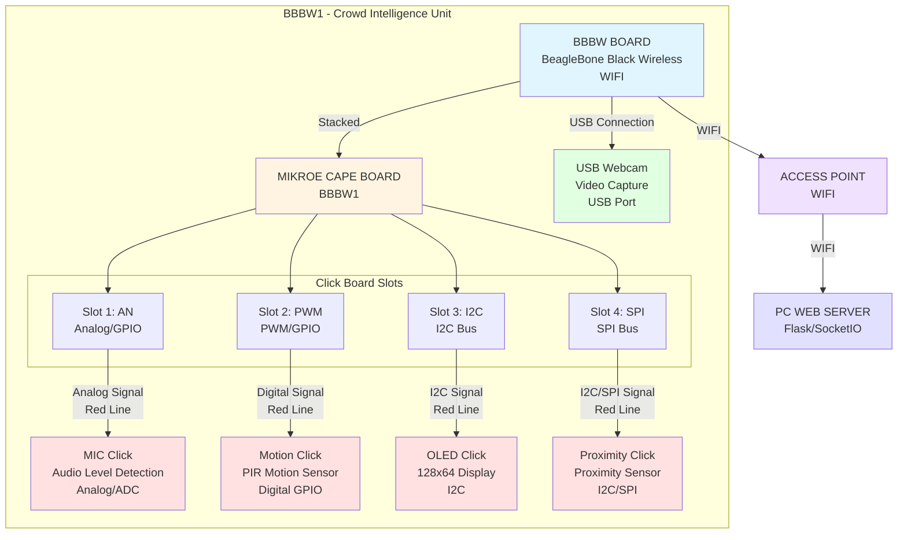
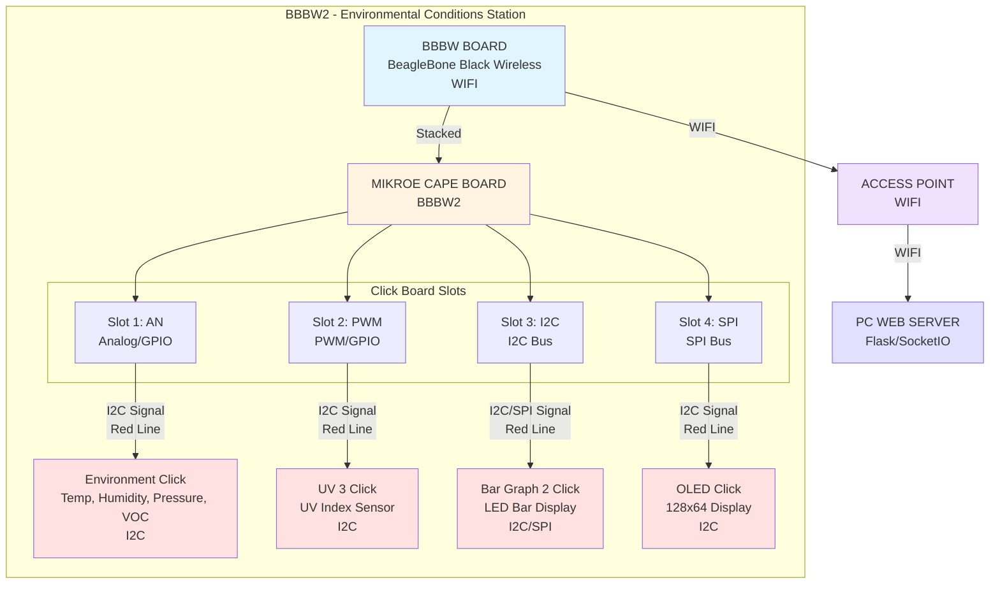
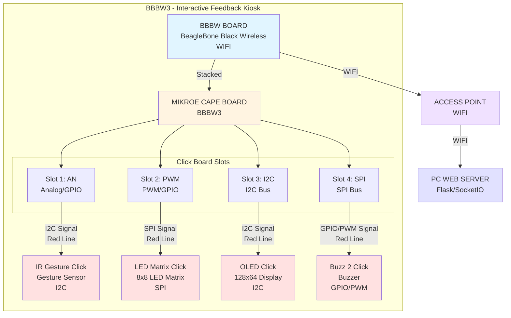
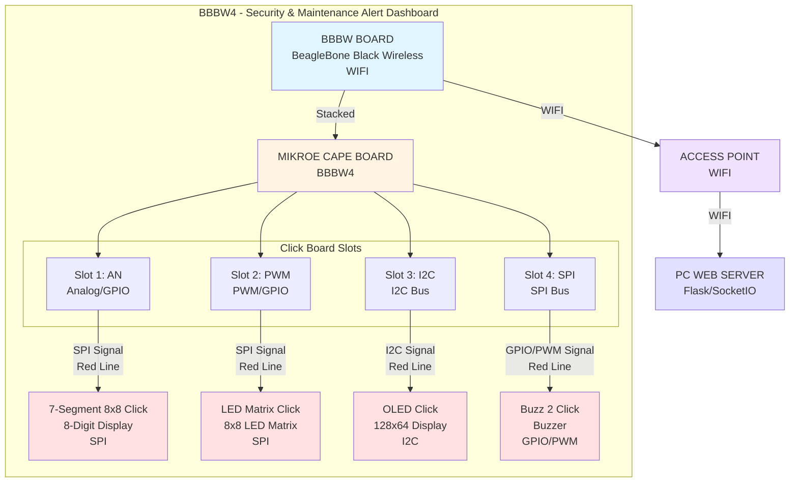
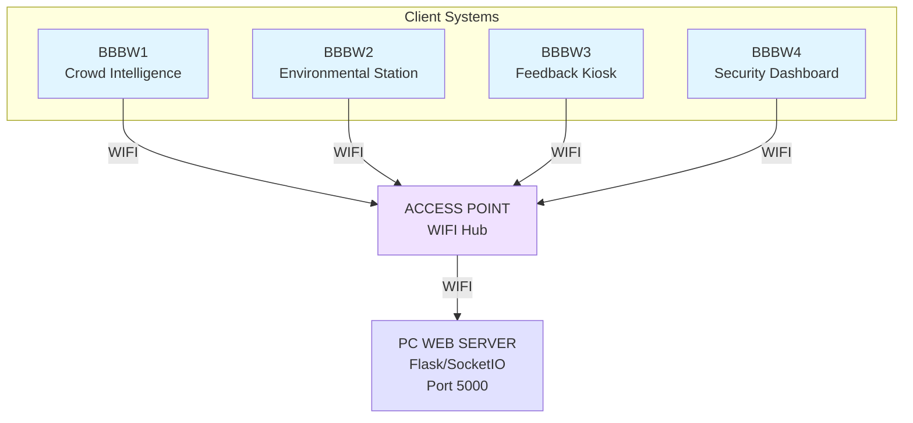

# System Block Diagrams - All Four Modules

This document contains system block diagrams for all four modules in the basketball court monitoring system.

---

## Module 1: Crowd Intelligence Unit
**"Real-time occupancy monitoring with multi-sensor validation"**

**Components:**
- **BBBW BOARD**: BeagleBone Black Wireless (main processing unit)
- **MIKROE CAPE BOARD**: Expansion board providing Click board interfaces
- **Slot 1 (AN)**: MIC Click - Audio level detection for activity monitoring
- **Slot 2 (PWM)**: Motion Click - PIR motion sensor for backup detection
- **Slot 3 (I2C)**: OLED Click - Local status display (128x64)
- **Slot 4 (SPI)**: Proximity Click - Detect people approaching court area
- **USB Webcam**: Video capture for AI-based people counting (connects via USB, not Click slot)

**Communication:**
- All modules connect wirelessly via WIFI to Access Point
- Access Point connects to PC Web Server running Flask/SocketIO
- Data transmitted: People count, crowd level, noise level, motion status, proximity status

---

## Module 2: Environmental Conditions Station
**"Sports-safe weather monitoring with air quality"**

**Components:**
- **BBBW BOARD**: BeagleBone Black Wireless (main processing unit)
- **MIKROE CAPE BOARD**: Expansion board providing Click board interfaces
- **Slot 1 (AN)**: Environment Click - Temperature, humidity, pressure, VOC (4-in-1 sensor)
- **Slot 2 (PWM)**: UV 3 Click - UV index sensor for sunburn risk assessment
- **Slot 3 (I2C)**: Bar Graph 2 Click - Visual comfort indicator (LED bars)
- **Slot 4 (SPI)**: OLED Click - Local display showing environmental readings (128x64)

**Communication:**
- Connects wirelessly via WIFI to Access Point
- Data transmitted: Temperature, humidity, pressure, UV index, VOC levels, comfort score

---

## Module 3: Interactive Feedback Kiosk
**"Community voice with intuitive gesture control"**

**Components:**
- **BBBW BOARD**: BeagleBone Black Wireless (main processing unit)
- **MIKROE CAPE BOARD**: Expansion board providing Click board interfaces
- **Slot 1 (AN)**: IR Gesture Click - Touchless gesture interaction (swipe, select, push)
- **Slot 2 (PWM)**: LED Matrix Click - 8x8 LED matrix for visual status/confirmation
- **Slot 3 (I2C)**: OLED Click - Display prompts and feedback (128x64)
- **Slot 4 (SPI)**: Buzz 2 Click - Audio feedback for interactions

**Communication:**
- Connects wirelessly via WIFI to Access Point
- Data transmitted: User ratings, maintenance reports, gesture interactions, feedback timestamps

---

## Module 4: Security & Maintenance Alert Dashboard
**"Real-time monitoring for residents, security, and maintenance staff"**

**Components:**
- **BBBW BOARD**: BeagleBone Black Wireless (main processing unit)
- **MIKROE CAPE BOARD**: Expansion board providing Click board interfaces
- **Slot 1 (AN)**: 7-Segment 8x8 Click - Shows current active alerts count
- **Slot 2 (PWM)**: LED Matrix Click - Visual status indicators (at-a-glance health)
- **Slot 3 (I2C)**: OLED Click - Main alert display (128x64)
- **Slot 4 (SPI)**: Buzz 2 Click - Audio alerts for urgent issues

**Communication:**
- Connects wirelessly via WIFI to Access Point
- Receives data from: Module 1 (crowd alerts), Module 2 (environment warnings), Module 3 (feedback/ratings)
- Displays: Unusual activity alerts, maintenance issues, noise complaints, facility status

---

## System Overview - All Modules Connected

**Network Architecture:**
- All four BBBW modules connect wirelessly to a central Access Point
- Access Point routes data to PC Web Server running Flask/SocketIO
- Server aggregates data from all modules and provides web dashboard
- Real-time bidirectional communication via WebSocket (SocketIO)

---

## Connection Details

### Signal Types (as shown in diagrams):
- **Red Lines**: Power and ground connections
- **Black Lines with Labels**: Data/signal connections
  - **DIGITAL SIGNAL**: GPIO, digital I/O
  - **ANALOG SIGNAL**: ADC, analog input
  - **I2C Signal**: I2C bus communication
  - **SPI Signal**: SPI bus communication

### MikroE Cape Board Connection Points:
- **P8/GPIO**: General purpose I/O pins
- **P9/GPIO**: General purpose I/O pins  
- **PWM/GPIO**: PWM and GPIO functionality
- **DIGITAL**: Digital signal lines
- **ANALOG**: Analog signal lines

### Click Board Slot Functions:
- **Slot 1 (AN)**: Analog/GPIO - ADC access, analog inputs
- **Slot 2 (PWM)**: PWM/GPIO - PWM outputs, digital I/O
- **Slot 3 (I2C)**: I2C bus - Multiple I2C devices can share
- **Slot 4 (SPI)**: SPI bus - SPI devices with different CS pins

---

**Last Updated:** 2025-01-27  
**Version:** 1.0
